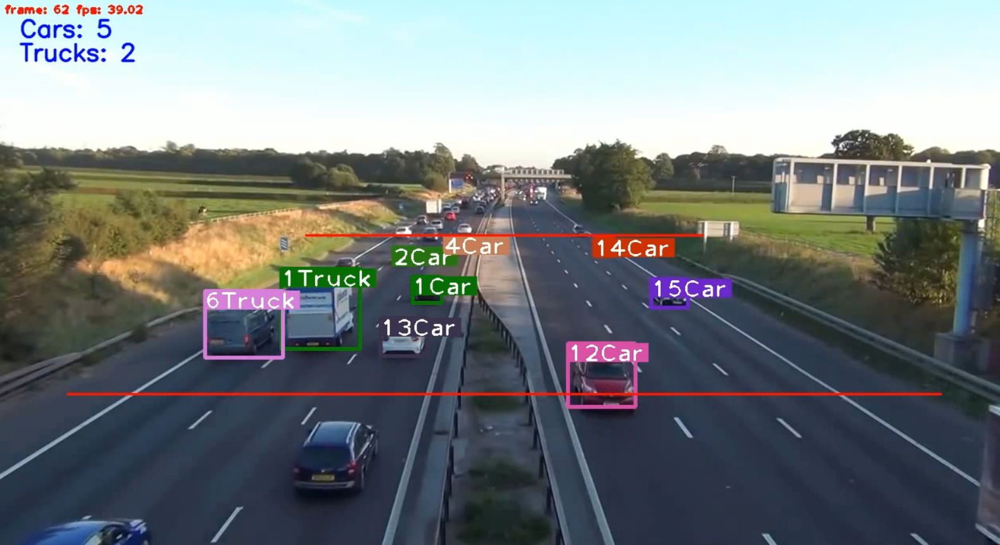

# Traffic-Vehicle-Tracking
## Counting no of traffic vehicles using YOLOv5s with DeepSORT algorithm

Script to count the number of instances per vehicle class for a given traffic video clip. 



#### Main components:
- Pytorch
- Opencv
- FFMPEG


#### Usage(for object tracking):
In order to show the inferences on a video file, for example: traffic_short.mp4, use the following command:
```sh
python main.py --input_path traffic_short.mp4 --display
```
In order to save the tracking inferences in form of video, use the following command:
```sh
python main.py --input_path traffic_short.mp4 --save_path out.mp4 --device 0 --display
```

#### Usage(only for detection):
In order to show the inferences on a video file, for example: traffic_short.mp4, use the following command:
```sh
python main.py --video traffic_short.mp4 --show_detections
```
To set the custom values of NMS threshold, confidence threshold, use the following command:
```sh
python main.py --video traffic_short.mp4 --show_detections --iou_thres 0.15 --conf_thres 0.20 
```
There is a cutoff distance is being used in the script. It is a threshold distance in pixels beyond which no detection instances will be counted. To use the threshold distance, use the following command:
```sh
python main.py --video traffic_short.mp4 --show_detections --distance_thres 300
```
To save the detection outputs in form of a video instead of displaying them in opencv window, use the - - save_path flag in the following way:
```sh
python main.py --video traffic_short.mp4 --save_path detection_output.mp4
```

#### External dependencies:
- YOLOV5    [https://pytorch.org/hub/ultralytics_yolov5/]
- Traffic video clip [https://www.youtube.com/watch?v=wqctLW0Hb_0&t=1s]

#### Additional
FFMPEG command to trim the long 30 minute video downloaded from youtube.
```sh
ffmpeg -ss 00:0:01 -i traffic.mp4 -to 00:02:00 -c copy output.mp4
```

